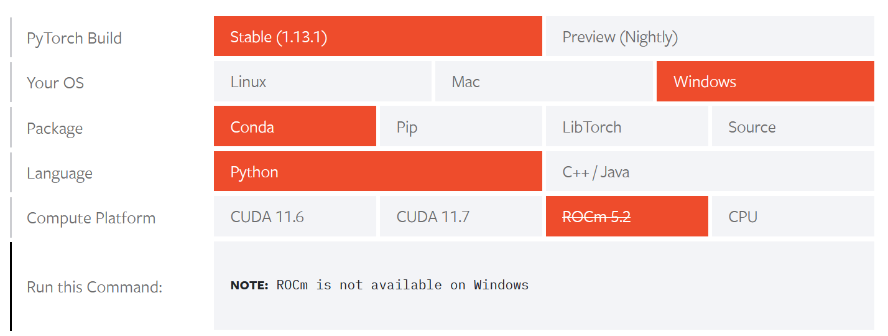
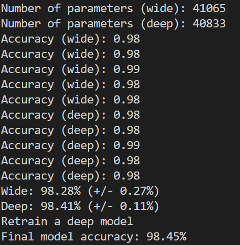

# Network Anomaly Detection System

In this project, the NSL-KDD dataset will be utilized to train a deep-machine-learning algorithm using PyTorch. The NSL-KDD dataset is solely utilized to teach/learn the machine about the network traffic.

First PyTorch needs to get installed. The issue with pytorch is that the current version of python (3.11) is not supported, therefore I had to install the version 3.7 which unfortunately does not have the performance upgrades that came with 3.11.
For working with PyTorch it is recommended to use an NVidia GPU. NVidia GPUs have CUDA-cores which massively boosts PyTorch's performance. For AMD GPU owners (like myself) pytorch can use the ROCm compute platform to make use of the GPU. Unfortunately it is not available for Windows.

Some people have implemented a way to still use AMD GPUs for pytorch, but it is very unreliable and prone to break. So I had to stick with the CPU.

## Convert the dataset (convert_dataset.py)
After downloading this project the "convert_dataset.py" will take the included NSL-KDD dataset and start converting it to a usable format. The converted dataset will be saved in a newly created "Data"-folder.
The reason why the dataset should be converted is because of text values and one hot encoding. Pytorch works with numbers and it cannot deal with strings very well. For example: TCP and UDP have to be converted to numbers. With the LabelEncoder we can automatically assign a numeric value to the string (for example: TCP 0, UPD 1).

    #Label Encoding 
    for col in text_columns:
        df_train_text_values_enc[col]=le.fit_transform(df_train_text_values[col])
        le_name_mapping[col] = dict(zip(le.classes_, le.transform(le.classes_)))

    #Saving Encoded values for later use
    with open('./Data/label_encode_values.json', 'w') as data: 
        data.write('"'+str(le_name_mapping)+'"')

This will enable pytorch to work with the values, but it will still not deliver great results. It also allows for our protocol type to be 0.5 (half TCP, half UDP) which in the real world is impossible.

### One hot encoding
The problem can be resolved through one hot encoding, where the protocol type is transformed into individual columns with each value represented in its own column. It is similar to a "is-a"-value. When using the TCP and UDP protocols as an example, the resulting one hot encoded dataset will contain separate columns indicating whether a given row "is-a"-TCP or "is-a"-UDP packet. This drastically enhances the quality of the neuronal network. In python the OneHotEncoder from sklearn.preprocessing takes over this task for the values. However, the column headers still need to be set manually:

    protocol=sorted(df_train.protocol_type.unique())
    protocol_header=['Protocol_' + x for x in protocol]

At the end the script removes the text columns of our Dataset/Dataframe and adds the encoded values to it, this increases the amount of columns to 117 (but most of them are just newly created one-hot-encoded-columns). 
The results are stored in ./Data/train_enc.csv and the Label_Encoder-values are stored in label_encode_values.txt.

The ./Data-directory is part of the .gitignore and therefore has to created/computed when cloning the git-project. 

## Learning (train_production.py, train_model_selection.py)

I created two python files for training. train_ train_model_selection.py and train_production.py. train_model_selection.py is optional and goes through a lot of tests to see which model works better for the machine. "A model with more layer is called a deeper model. A model with more parameters on each layer is called a wider model." (https://machinelearningmastery.com/). The implementation of the deep and wide model can be seen in the "classes"-directory. After trying both for a couple of times the deep-model works just a bit better for the use case.

The code is a standard binary-machine learning algorithm. 
To start, the converted dataset is read and the scripty defined x as our input variables and y as our output (normal or anomaly).

    data = pd.read_csv(trainfile_path, header=1)
    x = data.iloc[:, 0:config.col_length]
    y = data.iloc[:, config.col_length]

Next, the LabelEncoder is utilized once again to encode the "class_" attribute. Since "class" describes the output (normal/anomaly), it was not one hot encoded earlier.

Then the variables are getting added to the pytorch tensor:

    x = torch.tensor(x.values, dtype=torch.float32)
    y = torch.tensor(y, dtype=torch.float32).reshape(-1, 1)

A tensor is multidimensional matrix which holds all the data. In a very simplified manner, during operation, PyTorch will search for the most similar input-tensor and subsequently provide the corresponding output-tensor.

After that the system starts training itself and uses a 5-fold cross validation. This means that the system is training itself 5 times with a deep-model and 5-times with a wide-model and then compares the best results. For this test 70% of the converted data was used as input and 30% for tests. As depicted in the screenshot above, a deep learning model will be utilized for this project.

The train_production.py does the actual training in this case. The deep learning model is trained using the dataset. At the end the resulted neural network is saved to the ./Data/model.pth-file for later use. The script takes 99% of the data for training purposes and only 1% for testing. The reason for that is that I already did a lot of testing in the train_model_selection.py-file, so it's not really needed anymore. This is means that the train_model_selection.py-script is completely optional.

## Network detection (network_anomaly_detection.py)
Now that the system converted and learned the data it's time to use it on my own network. There are many ways to use this system. I could for example route every system to the server which has this script running. For simplicity I am only sniffing the network packets that this PC is receiving. To sniff the packets a tool called scapy is used. Scapy is a powerful Python-based interactive packet manipulation program and library that allows users to capture, decode, analyze, forge and inject network packets. However, just a simple pip install scapy will not work since scapy needs Npcap. On windows machines Npcap has to be downloaded and installed first in order to run scapy. 

Network_anomaly_detection.py is loading a lot of saved data including the trained machine learning model and then starts sniffing for network packages.

    model.eval()
    with torch.no_grad():
    print('Start scanning network traffic')
    sniff(prn=partial_handle_packet, store=0)

torch.no_grad() and model.eval() will set the model to evaluation-mode in order to get the results.
With sniff the system starts collecting network packets. Optionally a filter (for example TCP only) can be set or the packets can get stored, which I decided not to do, because it will eat up my memory.
Each packet is then getting passed to the partial_handle_packet function. This function just combines two parameters into a callback function which normally only uses one parameter.

    partial_handle_packet = functools.partial(handle_packet, my_model=model)

With this trick scapy can use handle_packet with the parameters “packet” and “model”. Handle packet checks if the network has a packet with an IP layer and then tries to analyze it. First, the data is getting initialized with the default values:

    data_arr = default()

and then the script sets the packet data into the correct columns.

    data_arr = set_packet_data(packet, data_arr)

After that the system uses our machine learning algorithm to detect anomalies and sends a post request to the user to inform him.

    x_test = data.iloc[:, 0:config.col_length]
    x_test = torch.tensor(x_test.values, dtype=torch.float32)
    y_pred = model(x_test)
    y_pred = (y_pred > config.threshold).float() # 0.0 or 1.0
    if y_pred == 1:
        #normal
        print("normal packet")
    else:
        print("anomaly detected!")
        #send to home server for anomaly alert 
        #sending the packet as a parameter 
        requests.post(config.url,data_arr, timeout=3) 

## My learnings

Overall, I learned a lot about machine learning while doing this project, probably even more than my machine ;). It was my first time doing a machine-learning-project and things like label-encoding, one-hot-encoding, deep vs wide neuronal networks were completely new for me. I was stuck a couple of times and going back and forth a ton of times. But I have/had a lot of fun programming and researching this. 

## Known Problems

If I would do this project again, I would do many things differently. One big problem that this project has is that the NSL-KDD dataset is not particularly good. It has a lot of attributes that I was unable to map because they are not documented or not part of the packet. For example: srv_serror_rate is set in the NSL-KDD dataset but not really part of a network package. Either I use a different trainings dataset or I try to get more than just network data. Either way I still had a lot of fun and will probably do similar projects like this again. 

# Sources
https://www.tutorialspoint.com/python_penetration_testing/python_penetration_testing_network_packet_sniffing.htm

https://betterprogramming.pub/building-a-packet-sniffing-tool-with-python-58ea5d65ace2

https://www.binarytides.com/python-packet-sniffer-code-linux/

https://towardsdatascience.com/categorical-encoding-using-label-encoding-and-one-hot-encoder-911ef77fb5bd

https://www.gkbrk.com/2016/05/hotel-music/

https://github.com/Mamcose/NSL-KDD-Network-Intrusion-Detection/blob/master/NID.ipynb

https://machinelearningmastery.com/building-a-binary-classification-model-in-pytorch/

https://pandas.pydata.org/docs/

https://pytorch.org/tutorials/

https://www.kaggle.com/code/avk256/nsl-kdd-anomaly-detection

